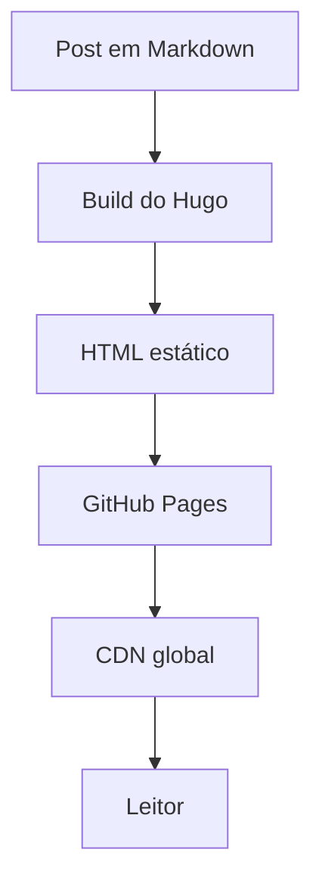

Quem acompanha a área de desenvolvimento sabe que montar um blog técnico parece simples, mas na verdade é um daqueles projetos que a gente sempre empurra com a barriga. Eu já vinha tentando tirar esse blog do papel fazia algum tempo, mas faltava transformar a ideia em execução.

Após trabalhando por alguns meses com **Codex**, eu estava procurando outros modelos para testar que não fosse o **Claude Code**. Um dos motivos é que estou usando o **OpenCode** e, por enquanto, quero seguir trabalhando com ele. Foi aí que resolvi testar o **GLM-5.1** e usar o blog como projeto prático: pequeno o suficiente para evoluir rápido, mas com complexidade suficiente para envolver templates, i18n, tema visual, deploy e conteúdo técnico.

O objetivo do blog também não é só ter uma página pessoal no ar. Quero usar este espaço para documentar estudos, testes e aprendizados do meu novo projeto no trabalho: a construção de um sistema que utilizará uma **LLM local** para permitir conversas entre usuários e dados gerais da empresa. Como esse tipo de solução passa por arquitetura, segurança, UX, avaliação de respostas e integração com dados internos, fazia sentido ter um lugar para registrar o processo.

## A stack

O blog roda com **Hugo** (v0.146.0 extended), um gerador de sites estáticos absurdamente rápido. A escolha foi bem pragmática: eu queria algo simples de manter, barato de hospedar, versionado em Git e que não dependesse de banco de dados, painel administrativo ou runtime em produção. Para um blog pessoal técnico, publicar arquivos estáticos bem gerados resolve quase tudo.

Também teve um componente de reaprendizado. Eu mexi com **Golang** há muitos anos, mas não é a stack com a qual estou habituado a trabalhar no dia a dia. Mesmo Hugo não exigindo escrever Go diretamente para montar um blog, a forma como ele organiza templates, partials, pipes, conteúdo e configuração é bem diferente do meu fluxo mais comum. Isso tornou o projeto útil também como exercício de adaptação a uma ferramenta e a uma mentalidade diferentes.

Sobre o Hugo, usei o tema **enervoid**, que já trazia uma base próxima do que eu queria: visual minimalista, tipografia monospace, estrutura limpa e uma estética meio terminal. A partir daí, o trabalho foi menos "criar um tema do zero" e mais adaptar com cuidado: overrides de templates, ajustes de layout, identidade visual, suporte multilíngue e detalhes de experiência de leitura.

A estrutura final ficou com conteúdo separado por idioma em `content/br` e `content/en`, traduções em `i18n/br.toml` e `i18n/en.toml`, overrides em `layouts/`, assets próprios e um workflow de deploy via **GitHub Actions** para **GitHub Pages**. O workflow faz checkout com submodules, executa o build do Hugo e publica o resultado no Pages com `baseURL` dinâmico. Na prática, escrever, commitar e fazer push para `main` é suficiente para atualizar o site.

Também configurei alguns recursos que considero importantes para um blog técnico: syntax highlighting com **Chroma** e tema Monokai, diagramas **Mermaid**, metadados **Open Graph** e **Twitter Card**, botões de compartilhamento, posts relacionados por tags e um modo claro em tom sepia para quem não gosta de ler em fundo escuro.

Mas o diferencial aqui foi o processo de criação.

## O modelo: GLM-5.1

Todo o código, a estrutura, os overrides de template, o suporte a i18n, a paleta de cores e o toggle claro/escuro foram construídos inicialmente em parceria com o modelo **GLM-5.1**, da Zhipu AI.

Não foi um "copiar e colar" de prompts. Foi um processo iterativo, onde cada etapa era planejada, executada, testada e refinada antes de seguir para a próxima.

O fluxo funcionava assim: eu descrevia o que queria, o modelo implementava, eu validava com `hugo server` e decidia se aprovava ou pedia ajustes. Isso me permitiu manter controle sobre o que estava sendo feito, mesmo sem escrever manualmente cada linha de template.

Começamos pela fundação: inicializar o projeto Hugo no repositório existente, adicionar o tema como submodule, configurar título, menu, avatar, links sociais e `.gitignore`. Depois veio a parte multilíngue, que exigiu mais atenção: o tema tinha algumas strings hardcoded, então criamos arquivos i18n e overrides para header, home, footer, metadados de artigo, listagem do blog e página individual de post.

Na sequência, trabalhamos a identidade visual. O header ganhou o `{amaral stack}`, o favicon virou um SVG com `{/}`, a home passou a destacar a foto, nome, tagline e redes sociais. A paleta original com tons de indigo foi substituída por uma combinação de azul, verde emerald e fundo quase preto. Mais tarde, adicionamos o modo claro sepia com persistência em `localStorage`, script anti-flash no `head` e re-renderização do Mermaid quando o tema muda.

As interações com a IA foram muito parecidas com um ciclo de pair programming assíncrono. Eu definia a intenção e as restrições, ela propunha uma alteração, eu testava, apontava o que não encaixava e seguíamos refinando.

Esse refinamento acabou sendo uma parte importante do processo. Muitas respostas não eram exatamente o resultado final, mas serviam como uma primeira versão para ajustar direção, nomenclatura, estilo visual e decisões de arquitetura. Algumas decisões foram objetivas, como trocar todas as ocorrências visuais de indigo por emerald. Outras exigiram julgamento, como decidir até onde sobrescrever o tema sem transformar o projeto em uma cópia difícil de atualizar.

Nem tudo saiu perfeito na primeira passada. Quando publiquei este post, o botão **Blog** no header não levava para a listagem correta. Tentei uma correção com o GLM-5.1, mas a solução não ficou boa. No final do processo, ainda ficaram alguns bugs de tradução e roteamento. Mesmo orientando o GLM-5.1 sobre o problema e explicando o comportamento esperado, ele não conseguiu fechar a correção de forma satisfatória. Foi nesse ponto que resolvi rodar o **GPT-5.5** para atacar especificamente esses ajustes finais e destravar a publicação.

## O que o blog suporta

Dependendo do tipo de conteúdo que eu for publicar, o blog já está preparado para renderizar tudo bonito. Aqui vão alguns exemplos:

### Syntax Highlighting

Hugo usa o Chroma por baixo dos panos, com o tema Monokai. Qualquer bloco de código com a linguagem especificada ganha highlighting automático:

```python
def fibonacci(n):
    if n <= 1:
        return n
    a, b = 0, 1
    for _ in range(2, n + 1):
        a, b = b, a + b
    return b

print(fibonacci(10))  # 55
```

```go
package main

import "fmt"

func main() {
    ch := make(chan string)
    go func() { ch <- "Amaral Stack" }()
    fmt.Println(<-ch)
}
```

```sql
SELECT p.title, COUNT(t.tag) AS tags
FROM posts p
JOIN post_tags t ON p.id = t.post_id
GROUP BY p.title
ORDER BY tags DESC;
```

### Diagramas com Mermaid

O blog também renderiza diagramas Mermaid diretamente no markdown. Isso é útil para visualizar arquiteturas, fluxos e relações:



## O que vem por aí

A ideia é usar este espaço para publicar sobre engenharia de software, arquitetura de sistemas, experiências com IA e, principalmente, sobre os estudos ligados ao projeto com LLM local no trabalho. Quero registrar tanto as decisões técnicas quanto os testes que derem certo ou errado.

Também pretendo seguir trabalhando com o **GLM-5.1** para entender melhor seu funcionamento. Apesar dos tropeços nos detalhes finais de tradução, ele foi útil para estruturar o projeto, acelerar experimentos e revelar onde a supervisão humana precisa ser mais cuidadosa. Se deu certo, você está lendo este post e tudo está funcionando.

Boa leitura. o/
