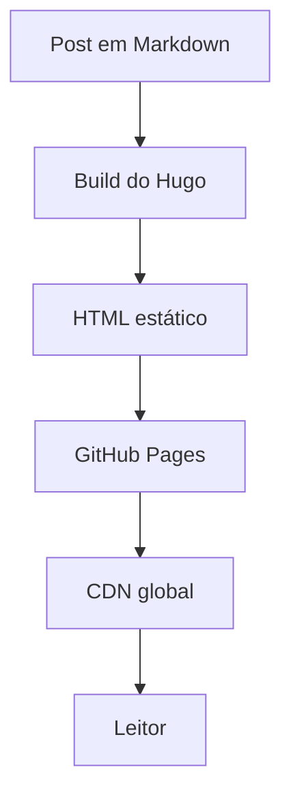

Após trabalhar codando com o **Codex** por alguns meses, eu estava procurando outros modelos para testar que não fosse o **Claude Code**. Um dos motivos é que estou usando o **OpenCode** e, por enquanto, quero seguir trabalhando com ele. Foi aí que resolvi testar o **GLM-5.1** e usar o blog como projeto prático: pequeno o suficiente para evoluir rápido, mas com complexidade suficiente para envolver templates, i18n, tema visual, deploy e conteúdo técnico.

O objetivo do blog também não é só ter uma página pessoal no ar. Quero usar este espaço para documentar estudos, testes e aprendizados do meu novo projeto no trabalho: a construção de um sistema que utilizará uma **LLM local** para permitir conversas entre usuários e dados gerais da empresa. Como esse tipo de solução passa por arquitetura, segurança, UX, avaliação de respostas e integração com dados internos, fazia sentido ter um lugar para registrar o processo.

## A stack

O blog roda com **Hugo** (v0.146.0 extended), um gerador de sites estáticos absurdamente rápido. A escolha foi bem pragmática: eu queria algo simples de manter, barato de hospedar, versionado em Git e que não dependesse de banco de dados, painel administrativo ou runtime em produção. Para um blog pessoal técnico, publicar arquivos estáticos bem gerados resolve quase tudo.

Também teve um componente de reaprendizado. Eu mexi com **Golang** há muitos anos, mas não é a stack com a qual estou habituado a trabalhar no dia a dia. Mesmo Hugo não exigindo escrever Go diretamente para montar um blog, a forma como ele organiza templates, partials, pipes, conteúdo e configuração é bem diferente do meu fluxo mais comum. Isso tornou o projeto útil também como exercício de adaptação a uma ferramenta e a uma mentalidade diferentes.

Sobre o Hugo, usei o tema **enervoid**, que já trazia uma base próxima do que eu queria: visual minimalista, tipografia monospace, estrutura limpa e uma estética meio terminal. A partir daí, o trabalho foi menos "criar um tema do zero" e mais adaptar com cuidado: overrides de templates, ajustes de layout, identidade visual, suporte multilíngue e detalhes de experiência de leitura.

A estrutura final ficou com conteúdo separado por idioma em `content/br` e `content/en`, traduções em `i18n/br.toml` e `i18n/en.toml`, overrides em `layouts/`, assets próprios e um workflow de deploy via **GitHub Actions** para **GitHub Pages**. O workflow faz checkout com submodules, executa o build do Hugo e publica o resultado no Pages com `baseURL` dinâmico. Na prática, escrever, commitar e fazer push para `main` é suficiente para atualizar o site.

Também configurei alguns recursos que considero importantes para um blog técnico: syntax highlighting com **Chroma** e tema Monokai, diagramas **Mermaid**, metadados **Open Graph** e **Twitter Card**, botões de compartilhamento, posts relacionados por tags e um modo claro em tom sepia para quem não gosta de ler em fundo escuro.

## O modelo: GLM-5.1

Todo o projeto foi construído em parceria com o modelo **GLM-5.1**, da Z.AI. A dinâmica funcionou como um ciclo de pair programming assíncrono: eu descrevia a intenção e as restrições, o modelo propunha uma implementação, eu validava com `hugo server` e decidia se aprovava ou pedia ajustes.

Muitas respostas não eram o resultado final, mas serviam como primeira versão para ajustar direção, nomenclatura e estilo visual. Algumas decisões foram objetivas, como trocar todas as ocorrências de indigo por emerald. Outras exigiram julgamento, como decidir até onde sobrescrever o tema sem transformar o projeto em uma cópia difícil de atualizar.

O GLM-5.1 se saiu bem na estruturação e na velocidade de experimentação, mas tropeçou nos detalhes finais. Bugs de tradução e roteamento persistiram mesmo após várias tentativas de correção. Foi aí que resolvi rodar o **GPT-5.5** para atacar especificamente esses ajustes e destravar a publicação.

## Do prompt ao plano

Tudo começou com um [arquivo de prompt inicial](https://github.com/leodramaral/amaral-stack/blob/main/content/br/construcao/initial-prompt.md) onde descrevi o que queria: tipo de site, requisitos funcionais e não funcionais, stacks e o tom do primeiro post. A partir desse prompt, o GLM-5.1 gerou o [plano de desenvolvimento](https://github.com/leodramaral/amaral-stack/blob/main/content/br/construcao/development-plan.md), dividindo o projeto em 9 fases — cada uma com escopo, entregável e mensagem de commit definidos.

Do início ao fim, entre planejamento, escolha do tema, leitura da documentação da stack, implementação, testes e ajustes, o blog saiu do zero ao primeiro post publicado em cerca de 3 horas de trabalho efetivo (não contando os intervalos). Foram 17 commits no total.

## O que mudou do plano original

O plano era ambicioso para o tempo disponível e, como todo plano, serviu mais como bússola do que como mapa exato. As 9 fases previstas viraram 17 commits — os 9 originais mais 8 de ajustes, refatorações e correções que surgiram ao longo do caminho.

Alguns pontos que mudaram:

- **Branding**: o plano original pedia a logo `<A/>`, mas durante o processo a identidade evoluiu para `{amaral stack}` com um favicon `{/}`. A mudança foi uma decisão de design tomada durante a implementação.
- **Idioma**: o plano usava `PT` como código de idioma, mas foi alterado para `BR` para ser mais preciso quanto à localização.
- **DBML**: o plano previa suporte a DBML para diagramas ER, mas acabou ficando de fora dessa versão inicial. Diagramas ER ainda podem ser feitos via `erDiagram` do Mermaid.
- **Submodule**: o tema enervoid começou como submodule do Git, mas foi trazido diretamente para dentro do repositório para simplificar manutenção e deploy.
- **dev-flow.txt**: a ideia era manter um log detalhado de desenvolvimento ao longo do processo, mas na prática acabei priorizando a velocidade de execução.
- **GPT-5.5**: não estava no plano original, mas foi necessário chamar outro modelo para resolver bugs de tradução e roteamento que o GLM-5.1 não conseguiu fechar sozinho.

Apesar dos desvios, o plano cumpriu seu papel: deu direção clara, permitiu trabalhar em blocos funcionais e manteve o projeto focado.

## O que o blog suporta

Dependendo do tipo de conteúdo que eu for publicar, o blog já está preparado para renderizar tudo bonito. Aqui vão alguns exemplos:

### Syntax Highlighting

Hugo usa o Chroma por baixo dos panos, com o tema Monokai. Qualquer bloco de código com a linguagem especificada ganha highlighting automático:

```python
def fibonacci(n):
    if n <= 1:
        return n
    a, b = 0, 1
    for _ in range(2, n + 1):
        a, b = b, a + b
    return b

print(fibonacci(10))  # 55
```

```go
package main

import "fmt"

func main() {
    ch := make(chan string)
    go func() { ch <- "Amaral Stack" }()
    fmt.Println(<-ch)
}
```

```sql
SELECT p.title, COUNT(t.tag) AS tags
FROM posts p
JOIN post_tags t ON p.id = t.post_id
GROUP BY p.title
ORDER BY tags DESC;
```

### Diagramas com Mermaid

O blog também renderiza diagramas Mermaid diretamente no markdown. Isso é útil para visualizar arquiteturas, fluxos e relações:



## O que vem por aí

A ideia é usar este espaço para publicar sobre engenharia de software, arquitetura de sistemas, experiências com IA e, principalmente, sobre os estudos ligados ao projeto com LLM local no trabalho. Quero registrar tanto as decisões técnicas quanto os testes que derem certo ou errado.

Também pretendo seguir trabalhando com o **GLM-5.1** para entender melhor seu funcionamento. Apesar dos tropeços nos detalhes finais de tradução, ele foi útil para estruturar o projeto, acelerar experimentos e revelar onde a supervisão humana precisa ser mais cuidadosa. Se deu certo, você está lendo este post e tudo está funcionando.

Boa leitura. o/
