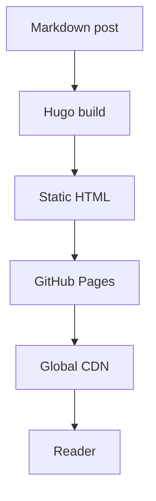

After working for a few months with **Codex**, I was looking for other models to test that were not **Claude Code**. One of the reasons is that I am using **OpenCode** and, for now, I want to keep working with it. That's when I decided to test **GLM-5.1** and use the blog as a practical project: small enough to move quickly, but complex enough to involve templates, i18n, visual theming, deployment, and technical content.

The goal of the blog is not just to have a personal page online. I want to use this space to document studies, tests, and learnings from my new work project: building a system that will use a **local LLM** to enable conversations between users and general company data. Since this kind of solution involves architecture, security, UX, response evaluation, and integration with internal data, it made sense to have a place to record the process.

## The Stack

The blog runs on **Hugo** (v0.146.0 extended), an absurdly fast static site generator. The choice was pragmatic: I wanted something easy to maintain, cheap to host, versioned in Git, and not dependent on a database, admin panel, or production runtime. For a personal technical blog, well-generated static files solve almost everything.

There was also a relearning aspect to it. I worked with **Golang** many years ago, but it is not the stack I am used to working with day to day. Even though Hugo does not require writing Go directly to build a blog, the way it organizes templates, partials, pipes, content, and configuration is very different from my usual workflow. That made the project useful as an exercise in adapting to a different tool and mindset.

On top of Hugo, I used the **enervoid** theme, which already had a foundation close to what I wanted: a minimal look, monospace typography, a clean structure, and a terminal-like aesthetic. From there, the work was less about "creating a theme from scratch" and more about carefully adapting it: template overrides, layout tweaks, visual identity, multilingual support, and reading-experience details.

The final structure has content split by language in `content/br` and `content/en`, translations in `i18n/br.toml` and `i18n/en.toml`, overrides in `layouts/`, custom assets, and a deployment workflow through **GitHub Actions** to **GitHub Pages**. The workflow checks out the repository with submodules, runs the Hugo build, and publishes the result to Pages with a dynamic `baseURL`. In practice, writing, committing, and pushing to `main` is enough to update the site.

I also configured a few features I consider important for a technical blog: syntax highlighting with **Chroma** and the Monokai theme, **Mermaid** diagrams, **Open Graph** and **Twitter Card** metadata, sharing buttons, related posts based on tags, and a sepia light mode for people who do not enjoy reading on a dark background.

## The Model: GLM-5.1

The entire project was built in partnership with the **GLM-5.1** model from Z.AI. The dynamic felt like an asynchronous pair programming loop: I described the intent and constraints, the model proposed an implementation, I validated with `hugo server`, and decided whether to approve or request adjustments.

Many responses were not the final result, but served as a first version to adjust direction, naming, and visual style. Some decisions were straightforward, like replacing all indigo occurrences with emerald. Others required judgment, like deciding how far to override the theme without turning the project into a fork that would be hard to update.

GLM-5.1 performed well in structuring and experimentation speed, but stumbled on the final details. Translation and routing bugs persisted even after several correction attempts. That was when I decided to run **GPT-5.5** specifically for those adjustments and unblock the publication.

## From Prompt to Plan

It all started with an [initial prompt file](https://github.com/leodramaral/amaral-stack/blob/main/content/br/construcao/initial-prompt.md) where I described what I wanted: site type, functional and non-functional requirements, stacks, and the tone for the first post. From that prompt, GLM-5.1 generated a [development plan](https://github.com/leodramaral/amaral-stack/blob/main/content/br/construcao/development-plan.md) dividing the project into 9 phases — each with scope, deliverable, and commit message defined.

From start to finish, including planning, theme selection, reading the stack documentation, implementation, testing, and adjustments, the blog went from zero to first published post in about 3 hours of active work (not counting breaks). 17 commits in total.

## What Changed from the Original Plan

The plan was ambitious for the available time, and like any plan, it served more as a compass than an exact map. The 9 planned phases turned into 17 commits — the 9 original ones plus 8 for adjustments, refactors, and fixes that came up along the way.

Some things that changed:

- **Branding**: the original plan asked for an `<A/>` logo, but during the process the identity evolved to `{amaral stack}` with an `{/}` favicon. The change was a design decision made during implementation.
- **Language code**: the plan used `PT` as the language code, but it was changed to `BR` to be more precise about the locale.
- **DBML**: the plan included DBML support for ER diagrams, but it ended up being left out of this initial version. ER diagrams can still be done via Mermaid's `erDiagram`.
- **Submodule**: the enervoid theme started as a Git submodule, but was brought directly into the repository to simplify maintenance and deployment.
- **dev-flow.txt**: the idea was to maintain a detailed development log throughout the process, but in practice I ended up prioritizing execution speed.
- **GPT-5.5**: not in the original plan, but it was necessary to call another model to resolve translation and routing bugs that GLM-5.1 could not fix on its own.

Despite the deviations, the plan served its purpose: it provided clear direction, allowed working in functional blocks, and kept the project focused.

## What the Blog Supports

Depending on the type of content I publish, the blog is already prepared to render everything nicely. Here are some examples:

### Syntax Highlighting

Hugo uses Chroma under the hood with the Monokai theme. Any code block with a specified language gets automatic highlighting:

```python
def fibonacci(n):
    if n <= 1:
        return n
    a, b = 0, 1
    for _ in range(2, n + 1):
        a, b = b, a + b
    return b

print(fibonacci(10))  # 55
```

```go
package main

import "fmt"

func main() {
    ch := make(chan string)
    go func() { ch <- "Amaral Stack" }()
    fmt.Println(<-ch)
}
```

```sql
SELECT p.title, COUNT(t.tag) AS tags
FROM posts p
JOIN post_tags t ON p.id = t.post_id
GROUP BY p.title
ORDER BY tags DESC;
```

### Diagrams with Mermaid

The blog also renders Mermaid diagrams directly in markdown. This is useful for visualizing architectures, flows, and relationships:



## What's Next

The plan is to use this space to publish about software engineering, system architecture, AI experiences, and especially the studies connected to the local LLM project at work. I want to document both the technical decisions and the tests that succeed or fail.

I also plan to keep working with **GLM-5.1** to better understand how it behaves. Despite the issues in the final translation and routing details, it was useful for structuring the project, accelerating experiments, and showing where human supervision needs to be more careful. If everything went right, you're reading this post and it's all working.

Happy reading. o/
