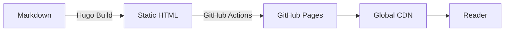
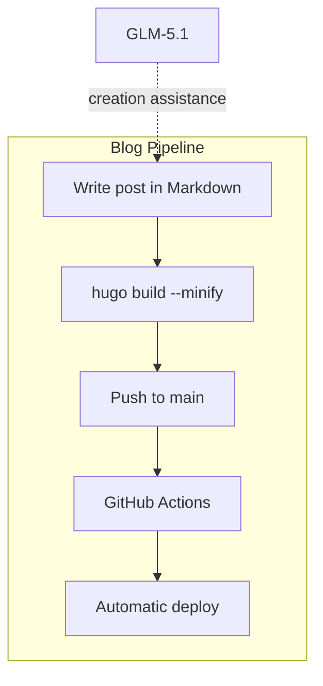

Anyone in software development knows that setting up a technical blog seems simple, but it's actually one of those projects you keep putting off. I decided to change that and use the opportunity to test something I'd been wanting to explore: **building an entire project with the help of generative AI**.

## The Stack

The blog runs on **Hugo** (v0.146.0 extended), an absurdly fast static site generator. On top of it, I use the **enervoid** theme — minimal, with monospace typography and a terminal vibe I really like. Deployment is automatic via **GitHub Actions** to **GitHub Pages**.

But the real differentiator here was the creation process.

## The Model: GLM-5.1

All the code, the structure, the template overrides, i18n support, color palette, light/dark toggle — everything was built in partnership with the **GLM-5.1** model, from Zhipu AI. This wasn't a "copy and paste from prompts" situation. It was an iterative, phased process where each step was planned, executed, and manually approved before moving to the next.

The workflow went like this: I described what I wanted, the model implemented it, I validated with `hugo server`, and decided whether to approve or request adjustments. Each phase produced a clean, semantic git commit. This allowed me to maintain full control over what was being done, even without manually writing every template line.

Not everything worked perfectly on the first pass. When I published this post, the **Blog** button in the header did not open the correct listing: the content lived in `content/pt` and `content/en`, but Hugo had not been told that each folder was the content directory for a language. The result was duplicated URLs like `/pt/pt/blog/`, while the menu pointed to `/pt/blog/`.

I tried fixing it with GLM-5.1, but the solution was not good enough and I had to revert the commits. The switch was to make the multilingual setup more explicit, with one `contentDir` per language and `pageRef` in the menu, letting Hugo resolve the right route for each language.

## What the Blog Supports

Depending on the type of content I publish, the blog is already prepared to render everything nicely. Here are some examples:

### Syntax Highlighting

Hugo uses Chroma under the hood with the Monokai theme. Any code block with a specified language gets automatic highlighting:

```python
def fibonacci(n):
    if n <= 1:
        return n
    a, b = 0, 1
    for _ in range(2, n + 1):
        a, b = b, a + b
    return b

print(fibonacci(10))  # 55
```

```go
package main

import "fmt"

func main() {
    ch := make(chan string)
    go func() { ch <- "Amaral Stack" }()
    fmt.Println(<-ch)
}
```

```sql
SELECT p.title, COUNT(t.tag) AS tags
FROM posts p
JOIN post_tags t ON p.id = t.post_id
GROUP BY p.title
ORDER BY tags DESC;
```

### Diagrams with Mermaid

The blog also renders Mermaid diagrams directly in markdown. This is useful for visualizing architectures, flows, and relationships:





## The Palette and Theme

The visual identity was designed to be comfortable for reading code: dark background with accents in **blue** and **vibrant green**. The `<amaral stack/>` in the header is the visual signature — a blend of code and branding.

For those who prefer reading with a light background, there's a toggle in the header that activates a **sepia** theme inspired by e-readers — no pure white that strains the eyes.

## What's Next

The plan is to use this space to publish about software engineering, system architecture, AI experiences, and whatever else comes up along the way. If everything went right, you're reading this post and it's all working.

Happy reading. o/
