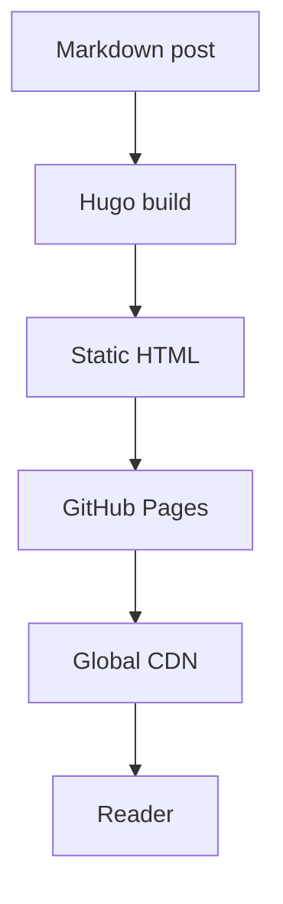

Anyone in software development knows that setting up a technical blog seems simple, but it's actually one of those projects you keep putting off. I had been trying to get this blog off the ground for a while, but the idea still needed to become execution.

After working for a few months with **Codex**, I was looking for other models to test that were not **Claude Code**. One of the reasons is that I am using **OpenCode** and, for now, I want to keep working with it. That's when I decided to test **GLM-5.1** and use the blog as a practical project: small enough to move quickly, but complex enough to involve templates, i18n, visual theming, deployment, and technical content.

The goal of the blog is not just to have a personal page online. I want to use this space to document studies, tests, and learnings from my new work project: building a system that will use a **local LLM** to enable conversations between users and general company data. Since this kind of solution involves architecture, security, UX, response evaluation, and integration with internal data, it made sense to have a place to record the process.

## The Stack

The blog runs on **Hugo** (v0.146.0 extended), an absurdly fast static site generator. The choice was pragmatic: I wanted something easy to maintain, cheap to host, versioned in Git, and not dependent on a database, admin panel, or production runtime. For a personal technical blog, well-generated static files solve almost everything.

There was also a relearning aspect to it. I worked with **Golang** many years ago, but it is not the stack I am used to working with day to day. Even though Hugo does not require writing Go directly to build a blog, the way it organizes templates, partials, pipes, content, and configuration is very different from my usual workflow. That made the project useful as an exercise in adapting to a different tool and mindset.

On top of Hugo, I used the **enervoid** theme, which already had a foundation close to what I wanted: a minimal look, monospace typography, a clean structure, and a terminal-like aesthetic. From there, the work was less about "creating a theme from scratch" and more about carefully adapting it: template overrides, layout tweaks, visual identity, multilingual support, and reading-experience details.

The final structure has content split by language in `content/br` and `content/en`, translations in `i18n/br.toml` and `i18n/en.toml`, overrides in `layouts/`, custom assets, and a deployment workflow through **GitHub Actions** to **GitHub Pages**. The workflow checks out the repository with submodules, runs the Hugo build, and publishes the result to Pages with a dynamic `baseURL`. In practice, writing, committing, and pushing to `main` is enough to update the site.

I also configured a few features I consider important for a technical blog: syntax highlighting with **Chroma** and the Monokai theme, **Mermaid** diagrams, **Open Graph** and **Twitter Card** metadata, sharing buttons, related posts based on tags, and a sepia light mode for people who do not enjoy reading on a dark background.

But the real differentiator here was the creation process.

## The Model: GLM-5.1

All the code, the structure, the template overrides, i18n support, color palette, and light/dark toggle were initially built in partnership with the **GLM-5.1** model, from Zhipu AI.

This wasn't a "copy and paste from prompts" situation. It was an iterative process where each step was planned, executed, tested, and refined before moving to the next.

The workflow went like this: I described what I wanted, the model implemented it, I validated with `hugo server`, and decided whether to approve or request adjustments. This allowed me to maintain control over what was being done, even without manually writing every template line.

We started with the foundation: initializing the Hugo project inside the existing repository, adding the theme as a submodule, configuring the title, menu, avatar, social links, and `.gitignore`. Then came the multilingual layer, which required more attention: the theme had a few hardcoded strings, so we created i18n files and overrides for the header, home page, footer, article metadata, blog listing, and individual post page.

Next came the visual identity. The header got the `{amaral stack}` signature, the favicon became an SVG with `{/}`, and the home page started highlighting the photo, name, tagline, and social links. The original palette with indigo tones was replaced by a combination of blue, emerald green, and a nearly black background. Later, we added the sepia light mode with persistence in `localStorage`, an anti-flash script in the `head`, and Mermaid re-rendering when the theme changes.

The interactions with the AI felt a lot like an asynchronous pair programming loop. I defined the intent and constraints, it proposed a change, I tested it, pointed out what did not fit, and we refined from there.

That refinement became an important part of the process. Many responses were not exactly the final result, but they served as a first version to adjust direction, naming, visual style, and architecture decisions. Some decisions were straightforward, like replacing the visual indigo accents with emerald. Others required judgment, like deciding how far to override the theme without turning the project into a fork that would be hard to update.

Not everything worked perfectly on the first pass. When I published this post, the **Blog** button in the header did not open the correct listing. I tried fixing it with GLM-5.1, but the solution was not good enough. At the end of the process, there were still a few translation and routing bugs. Even after I explained the issue to GLM-5.1 and described the expected behavior, it did not close the fix in a satisfactory way. That was when I decided to run **GPT-5.5** specifically for those final adjustments and unblock the publication.

## What the Blog Supports

Depending on the type of content I publish, the blog is already prepared to render everything nicely. Here are some examples:

### Syntax Highlighting

Hugo uses Chroma under the hood with the Monokai theme. Any code block with a specified language gets automatic highlighting:

```python
def fibonacci(n):
    if n <= 1:
        return n
    a, b = 0, 1
    for _ in range(2, n + 1):
        a, b = b, a + b
    return b

print(fibonacci(10))  # 55
```

```go
package main

import "fmt"

func main() {
    ch := make(chan string)
    go func() { ch <- "Amaral Stack" }()
    fmt.Println(<-ch)
}
```

```sql
SELECT p.title, COUNT(t.tag) AS tags
FROM posts p
JOIN post_tags t ON p.id = t.post_id
GROUP BY p.title
ORDER BY tags DESC;
```

### Diagrams with Mermaid

The blog also renders Mermaid diagrams directly in markdown. This is useful for visualizing architectures, flows, and relationships:



## What's Next

The plan is to use this space to publish about software engineering, system architecture, AI experiences, and especially the studies connected to the local LLM project at work. I want to document both the technical decisions and the tests that succeed or fail.

I also plan to keep working with **GLM-5.1** to better understand how it behaves. Despite the issues in the final translation and routing details, it was useful for structuring the project, accelerating experiments, and showing where human supervision needs to be more careful. If everything went right, you're reading this post and it's all working.

Happy reading. o/
