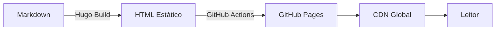
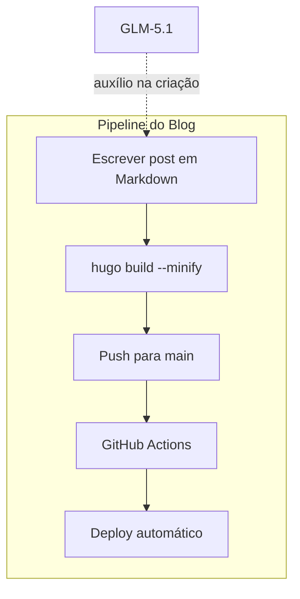

Quem acompanha a área de desenvolvimento sabe que montar um blog técnico parece simples, mas na verdade é um daqueles projetos que a gente sempre empurra com a barriga. Decidi mudar isso e usar a oportunidade para testar algo que vinha querendo explorar: **construir um projeto inteiro com auxílio de IA generativa**.

## A stack

O blog roda com **Hugo** (v0.146.0 extended), um gerador de sites estáticos absurdamente rápido. Sobre ele, uso o tema **enervoid** — minimalista, com tipografia monospace e vibe de terminal que eu curto bastante. O deploy é automático via **GitHub Actions** para o **GitHub Pages**.

Mas o diferencial aqui foi o processo de criação.

## O modelo: GLM-5.1

Todo o código, a estrutura, os overrides de template, o suporte a i18n, a paleta de cores, o toggle claro/escuro — tudo foi construído em parceria com o modelo **GLM-5.1**, da Zhipu AI. Não foi um "copiar e colar" de prompts. Foi um processo iterativo, faseado, onde cada etapa era planejada, executada e aprovada manualmente antes de seguir para a próxima.

O fluxo funcionava assim: eu descrevia o que queria, o modelo implementava, eu validava com `hugo server` e decidia se aprovava ou pedia ajustes. Cada fase gerava um commit git limpo e semântico. Isso me permitiu manter controle total sobre o que estava sendo feito, mesmo sem escrever manualmente cada linha de template.

Nem tudo saiu perfeito na primeira passada. Quando publiquei este post, o botão **Blog** no header não levava para a listagem correta: o conteúdo estava em `content/pt` e `content/en`, mas o Hugo ainda não sabia que cada pasta era o diretório de conteúdo de um idioma. O resultado eram URLs duplicadas, como `/pt/pt/blog/`, enquanto o menu apontava para `/pt/blog/`.

Tentei uma correção com o GLM-5.1, mas a solução não ficou boa e precisei reverter os commits. A troca foi assumir uma configuração multilíngue mais explícita, com `contentDir` por idioma e `pageRef` no menu, deixando o Hugo resolver a rota certa para cada língua.

## O que o blog suporta

Dependendo do tipo de conteúdo que eu for publicar, o blog já está preparado para renderizar tudo bonito. Aqui vão alguns exemplos:

### Syntax Highlighting

Hugo usa o Chroma por baixo dos panos, com o tema Monokai. Qualquer bloco de código com a linguagem especificada ganha highlighting automático:

```python
def fibonacci(n):
    if n <= 1:
        return n
    a, b = 0, 1
    for _ in range(2, n + 1):
        a, b = b, a + b
    return b

print(fibonacci(10))  # 55
```

```go
package main

import "fmt"

func main() {
    ch := make(chan string)
    go func() { ch <- "Amaral Stack" }()
    fmt.Println(<-ch)
}
```

```sql
SELECT p.title, COUNT(t.tag) AS tags
FROM posts p
JOIN post_tags t ON p.id = t.post_id
GROUP BY p.title
ORDER BY tags DESC;
```

### Diagramas com Mermaid

O blog também renderiza diagramas Mermaid diretamente no markdown. Isso é útil para visualizar arquiteturas, fluxos e relações:





## A paleta e o tema

A identidade visual foi pensada para ser confortável para quem lê código: fundo escuro com acentos em **azul** e **verde vibrante**. O `<amaral stack/>` no header é a assinatura visual — uma mistura de código com branding.

Para quem prefere ler com fundo claro, tem o toggle no header que ativa um tema **sepia** inspirado nos leitores digitais, nada de branco puro que cansa os olhos.

## O que vem por aí

A ideia é usar este espaço para publicar sobre engenharia de software, arquitetura de sistemas, experiências com IA e tudo mais que surgir pelo caminho. Se deu certo, você está lendo este post e tudo está funcionando.

Boa leitura. o/
